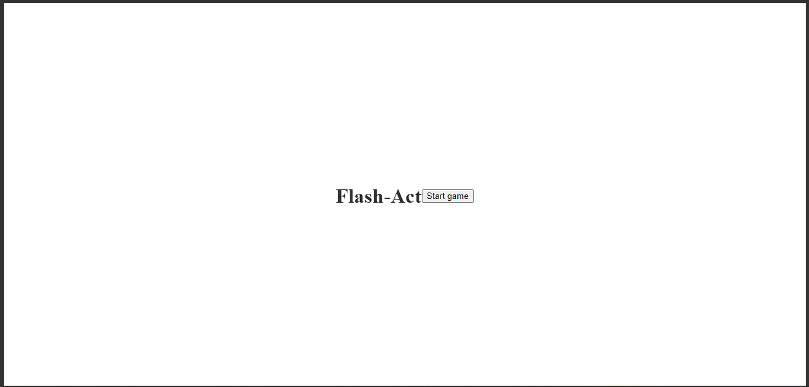

# Flash-Act
# Reaction time based 1v1 game

# Play my Game [here](https://flash-act.netlify.app/)

## Flash-Act is a challenging multiplayer JavaScript game where you test your reaction time against your friends. The goal is simple: be the first to hit a button as close as possible to the end of a song. The player with the fastest reaction time scores a point, and the game will continue for multiple rounds until a winner is determined.

How To Play
To play Flash-Act, you will need two players and a device with access to the internet. Here are the steps the game will take you through:

- Open the Flash-Act game in your browser.
- Choose player 1 or 2 between users
- Click start game to start the countdown
- The players should watch the countdown timer and prepare to respond as close to the songs end as possible
- When the song ends, both players hit their buttons
- The game will calculate the reaction times of each player, and display their results.
- The player with the fastest reaction time scores a point.
- Repeat steps 3-7 until a winner is determined.

#Technologies Used
Flash-Act is a JavaScript, HTML, and CSS based game. The game relies on the Web Audio API to play the song and measure the player's reaction time.

##References Used

MDN Web Docs. (n.d.). Mozilla Developer Network. https://developer.mozilla.org/en-US/

Stack Overflow. (n.d.). Stack Exchange Inc. https://stackoverflow.com/

Google. (n.d.). Google Search Engine. https://www.google.com/

two inputs, one kill, one win, one loss....

.png)
